<a href="https://avinashk.in">
  <picture>
    <source media="(prefers-color-scheme: dark)" srcset="./card-dark.svg">
    
  </picture>
</a>

<p align="center">
  <a href="https://avinashk.in"><b>avinashk.in</b></a> &nbsp;·&nbsp;
  <a href="https://avinashk.in/blog/">blog</a> &nbsp;·&nbsp;
  <a href="mailto:avinashkamadri16@gmail.com">email</a> &nbsp;·&nbsp;
  <a href="https://x.com/enzofordddddd">x.com</a>
</p>

### `> cat now.md`

- Building web apps, front end and back end
- Writing about F1 on [my blog](https://avinashk.in/blog/)
- My homepage is a terminal. Type `/help` on [avinashk.in](https://avinashk.in)

### `> ls blog/`

| Date | Post | Read |
| --- | --- | --- |
| Oct 3, 2026 | [Max vs Lewis: the 2021 title fight](https://avinashk.in/blog/max-vs-lewis-2021/) | 4 min |
| Oct 3, 2026 | [Daniel Ricciardo: the smile and the late brake](https://avinashk.in/blog/daniel-ricciardo-career/) | 3 min |
| Oct 3, 2026 | [Michael Schumacher: building a dynasty](https://avinashk.in/blog/michael-schumacher/) | 3 min |
| Oct 3, 2026 | [Lewis Hamilton: from Stevenage to seven titles](https://avinashk.in/blog/lewis-hamilton/) | 2 min |
| Oct 3, 2026 | [Fernando Alonso: the one who never stops](https://avinashk.in/blog/fernando-alonso/) | 2 min |
| Oct 3, 2026 | [Valtteri Bottas: the quiet one](https://avinashk.in/blog/valtteri-bottas/) | 2 min |
| Oct 2, 2026 | [A terminal for a homepage](https://avinashk.in/blog/a-terminal-for-a-homepage/) | 2 min |
| Sep 30, 2026 | [Lapping Spa in the browser](https://avinashk.in/blog/lapping-spa-in-the-browser/) | 3 min |

### `> cat stack.txt`

```text
frontend   Next.js
backend    NestJS
data       PostgreSQL · Prisma
infra      Docker · AWS
ai         ML Agents
```

<sub>The dragon lives at <a href="https://avinashk.in">avinashk.in</a>. Type <code>/dragon</code> to say hi.</sub>
